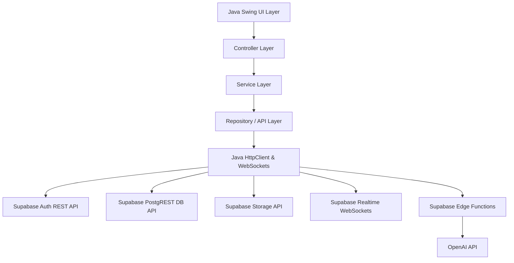
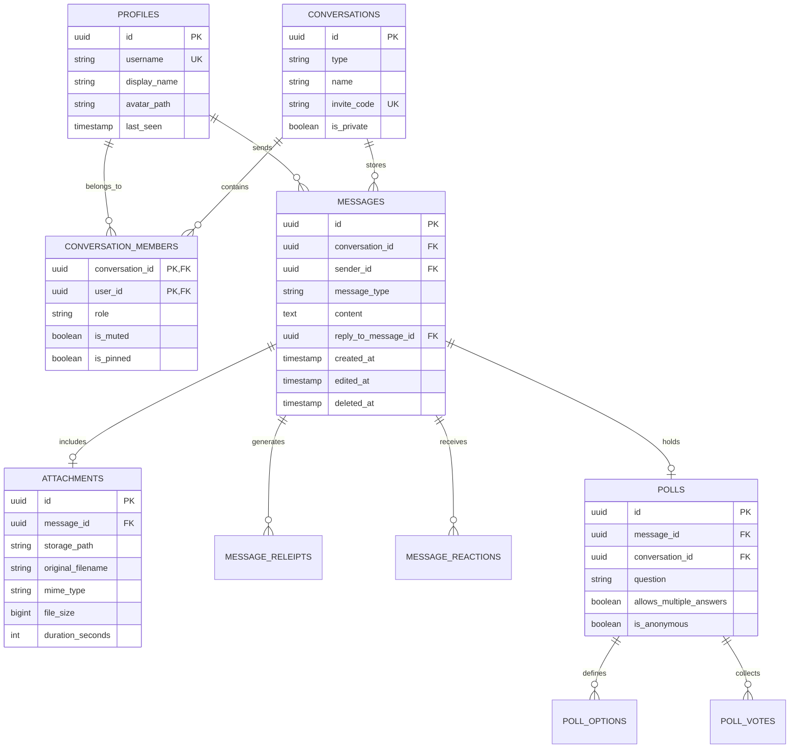
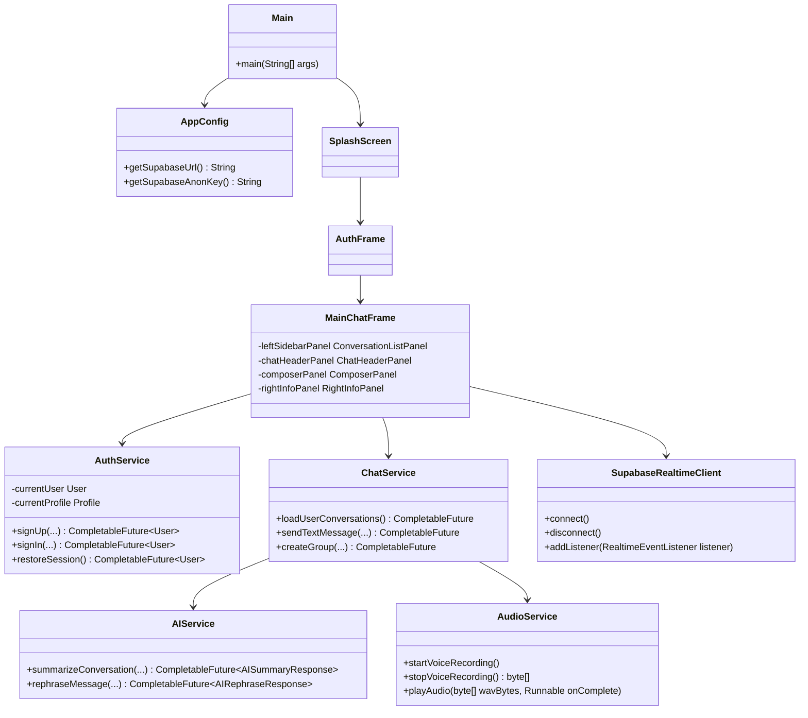

<<<<<<< HEAD
# J
=======
# ConnectAI — AI-Powered Realtime Java Desktop Chat Application

[](https://jdk.java.net/21/)
[](https://docs.oracle.com/en/java/javase/21/docs/api/java.desktop/module-summary.html)
[](https://supabase.com)
[](https://openai.com)

**ConnectAI** is a production-grade, cross-platform Java Swing desktop chat messenger featuring real-time messaging, Supabase authentication, database synchronization, storage attachment sharing, voice note recording/playback, live polling, and AI features powered by Supabase Edge Functions and OpenAI.

---

## 1. System Architecture & Diagrams

### Architecture Diagram



---

### Entity-Relationship (ER) Diagram



---

### Class Diagram



---

## 2. Setup & Execution Instructions

### Prerequisites
- **Java JDK 21+**
- **Apache Maven 3.8+** (or use included Maven dist)
- **Supabase Account** (Free Tier)
- **OpenAI API Key**

---

### Step 1: Database Setup (Supabase SQL)
1. Go to your [Supabase Dashboard](https://database.new).
2. Open the **SQL Editor** tab.
3. Run the scripts in the following order:
   - `database/schema.sql` (Creates tables, triggers, indexes)
   - `database/rls-policies.sql` (Enables Row Level Security policies)
   - `database/storage-policies.sql` (Configures `chat-attachments` storage bucket & policies)
   - `database/sample-data.sql` (Optional seed script)

---

### Step 2: Supabase Edge Function Setup
1. Install Supabase CLI:
   ```bash
   npm i -g supabase
   ```
2. Link your local project:
   ```bash
   supabase link --project-ref YOUR_SUPABASE_PROJECT_REF
   ```
3. Set your OpenAI API key secret in Supabase:
   ```bash
   supabase secrets set OPENAI_API_KEY=sk-proj-YOUR_ACTUAL_OPENAI_KEY
   ```
4. Deploy the `ai-assistant` Edge Function:
   ```bash
   supabase functions deploy ai-assistant
   ```

---

### Step 3: Application Configuration
Edit `src/main/resources/application.properties` or set environment variables:

```properties
supabase.url=https://YOUR_PROJECT_ID.supabase.co
supabase.anon.key=YOUR_SUPABASE_ANON_KEY
```

Or environment variables:
```bash
export SUPABASE_URL=https://YOUR_PROJECT_ID.supabase.co
export SUPABASE_ANON_KEY=YOUR_SUPABASE_ANON_KEY
```

---

### Step 4: Build and Run

#### Compile and run tests:
```bash
/Users/abhinavaby/.m2/wrapper/dists/apache-maven-3.9.16/56ba1f9f/bin/mvn clean test
```

#### Build executable fat JAR:
```bash
/Users/abhinavaby/.m2/wrapper/dists/apache-maven-3.9.16/56ba1f9f/bin/mvn clean package
```

#### Execute the fat JAR:
```bash
java -jar target/connectai-1.0.0.jar
```

---

### Step 5: Running inside Docker (Web Browser / VNC)

ConnectAI includes a complete Docker setup with **noVNC** so you can run the Java Swing desktop application inside a Docker container and view/interact with it directly in your web browser!

#### Option A: Using Docker Compose (Recommended)
```bash
docker compose up --build
```
Then open your web browser to:
👉 **[http://localhost:6080/vnc.html](http://localhost:6080/vnc.html)** (or `http://localhost:6080`)

#### Option B: Using Docker CLI
```bash
# 1. Build the Docker image
docker build -t connectai-app .

# 2. Run the container
docker run -d -p 6080:6080 -p 5900:5900 --name connectai_desktop connectai-app
```
Access the application UI in your browser at `http://localhost:6080/vnc.html`.

---

## 3. Viva Technical Concepts Explanation

### 1. Java Object-Oriented Programming (OOP)
- **Encapsulation**: All data models (`User`, `Message`, `Conversation`) restrict direct field access via private members and validated getter/setter methods.
- **Inheritance & Polymorphism**: Custom GUI elements (`PremiumButton`, `RoundedPanel`, `RoundedTextField`) extend Swing base components (`JButton`, `JPanel`, `JTextField`) and override `paintComponent()` for custom vector anti-aliased rendering.
- **Interfaces**: Listener pattern in `RealtimeEventListener` allows UI components to react to WebSocket network events loosely coupled.

### 2. Swing EDT & Multithreading
- **Event Dispatch Thread (EDT)**: Swing components are updated strictly on the EDT using `SwingUtilities.invokeLater()`.
- **Background Execution**: Asynchronous operations (HTTP API requests, file uploads, audio recording) run off the UI thread via `CompletableFuture` and `SwingWorker` to ensure 60fps UI responsiveness.

### 3. Networking & Realtime WebSockets
- **Java HttpClient**: Uses Java 21 `java.net.http.HttpClient` with non-blocking asynchronous futures.
- **WebSockets**: Implemented via `org.java_websocket.client.WebSocketClient` maintaining heartbeats (`phx_ping`) and auto-reconnection exponential backoff.

### 4. Java Sound API (`javax.sound.sampled`)
- Direct PCM voice capture using `TargetDataLine`, multi-threaded buffer streaming, WAV container header formatting, and hardware playback via `Clip`.

---

## 4. Troubleshooting Guide

| Issue | Cause | Solution |
| :--- | :--- | :--- |
| **Session fails to restore** | Expired refresh token or missing `local-session.json` | Log in again via the Auth UI. |
| **Microphone error on record** | OS microphone permission blocked | Grant microphone permissions to Java process in OS Security settings. |
| **Edge Function 401 Unauthorized** | Invalid Supabase JWT or missing header | Check that user is signed in before calling AI features. |
| **WebSocket disconnects** | Intermittent network or idle timeout | `SupabaseRealtimeClient` will automatically reconnect using exponential backoff. |
>>>>>>> b5fc069 (Setup mock data provider for offline UI layout exploration)
